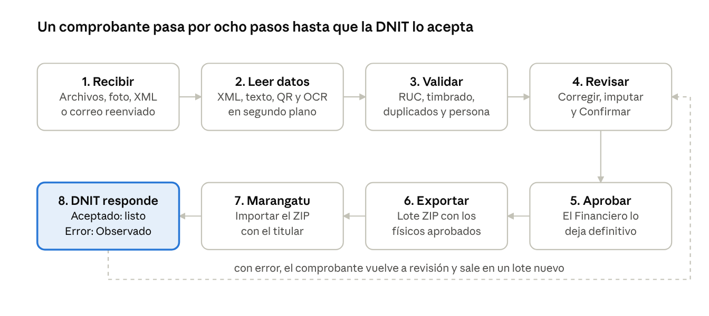

# ComprobantePy – Instructivo de usuario

Versión del 10/10/2026

## Qué es ComprobantePy

ComprobantePy reúne los comprobantes de compras y gastos de varios contribuyentes de una familia, lee sus datos, los valida y genera el archivo para importarlos en **Marangatu** (DNIT). También lleva el seguimiento del **IRP-RSP** de cada persona.

Resuelve cuatro problemas:

- **Recibir** comprobantes por cualquier vía: foto con el celular, PDF, XML de factura electrónica o correo reenviado.
- **Leer** los datos solo: RUC, timbrado, número, fecha, importes e IVA, incluso de fotos (OCR) y códigos QR.
- **Controlar** que cada comprobante sea válido, no esté duplicado y quede asignado a la persona correcta.
- **Declarar**: generar el archivo de Marangatu, seguir el resultado de la DNIT y proyectar el IRP-RSP.

**Cómo se usa.** Es una aplicación web: se abre en el navegador de la computadora (Chrome o Edge) o del celular, en la dirección que te indique quien la instaló (en la PC: `http://localhost:5173`). No hace falta instalar nada en el celular.

**Quién la usa.** Cada persona tiene su usuario y un **perfil por contribuyente**: puede ser Financiero para un familiar y solo Consulta para otro. El sistema muestra a cada usuario únicamente los contribuyentes que tiene asignados.

## Ingreso al sistema

Se entra con correo, contraseña y, para los perfiles Administrador y Financiero, un código de 6 dígitos del celular (segundo factor).

1. Abrí la dirección de la aplicación y escribí tu **correo electrónico** y **contraseña** → **Ingresar**.
2. **La primera vez** aparece un código QR. Escanealo con **Google Authenticator**, **Microsoft Authenticator** o **Authy** y escribí el código de 6 dígitos que muestra la app → **Confirmar**.
3. Las veces siguientes, después de la contraseña, escribí el código que muestra la app en ese momento (cambia cada 30 segundos).

La sesión se cierra sola después de 12 horas. Para salir antes: botón **Salir**, arriba a la derecha.

**Mi cuenta** (arriba a la derecha): para cambiar tu contraseña. Al cambiarla se cierran tus otras sesiones abiertas.

**Selector «Contribuyente»** (arriba): elige la persona con la que trabajás. Todas las pantallas (bandeja, proveedores, correo, reportes) muestran solo lo de esa persona. Con **Todos los contribuyentes** ves todo lo que tu perfil permite.

**Si perdés el celular o la contraseña**, el administrador puede restablecer tu segundo factor o darte una contraseña temporal desde **Usuarios**.

## Recorrido de un comprobante

Todo comprobante sigue el mismo camino, de la carga a la respuesta de la DNIT; los pasos 1 a 3 los hace el sistema solo.

Los pasos 4 y 5 los hacen personas: un Auxiliar o Financiero revisa y confirma, y el Financiero aprueba. Lo aprobado alimenta también el **Reporte** y el **IRP-RSP**. Los electrónicos y virtuales terminan en el paso 5: no se exportan.

## Los módulos, uno por uno

El menú de arriba tiene 10 módulos. Esta tabla resume para qué sirve cada uno y quién lo usa; debajo, el detalle.

| Módulo | Para qué sirve | Quién lo usa |
| --- | --- | --- |
| Inicio | Ver qué hay pendiente | Todos |
| Cargar | Subir comprobantes y correos | Auxiliar, Financiero |
| Bandeja | Revisar, corregir, imputar y aprobar | Auxiliar, Financiero (Consulta solo mira) |
| Exportar | Generar el archivo de Marangatu y seguir los lotes | Financiero |
| Reporte | Totales por naturaleza, destino y obligación | Todos |
| IRP-RSP | Ingresos, egresos, proyección y cierres | Financiero |
| Correo | Buzones y mensajes recibidos | Administrador, Financiero |
| Proveedores | Datos de proveedores y timbrados | Auxiliar, Financiero |
| Contribuyentes | Personas de la familia, obligaciones y actividades | Administrador |
| Usuarios | Cuentas y perfiles | Administrador |

### Inicio

Muestra cuántos comprobantes esperan algo y lleva directo a ellos: **Listos para revisar**, **Confirmados (a aprobar)**, **Proveedor a confirmar**, **Sin contribuyente**, **Posibles duplicados** y los que tienen datos faltantes. Si hay una alerta (por ejemplo, el correo se desconectó), aparece en una franja arriba.

### Cargar

Sube uno o varios comprobantes a la vez.

- **Elegir archivos de comprobantes:** PDF, XML de factura electrónica o imágenes. También correos guardados como `.eml`.
- **Tomar foto del comprobante:** en el celular abre la cámara.
- **Naturaleza:** Físico, Electrónico o «No sé / que lo detecte el sistema». Un XML o un documento con CDC se reconoce como electrónico igual.
- **Carga manual:** crea un comprobante vacío para escribir los datos a mano.

Qué hace el sistema con cada archivo:

- **XML** y **PDF con texto:** lee los datos al instante.
- **Fotos y PDF escaneados:** el comprobante se registra enseguida y los datos se completan en segundo plano en unos segundos (OCR en español). Si la foto tiene el QR de una factura electrónica, toma sus datos del QR. Si la foto salió borrosa, lo avisa.
- **El mismo comprobante dos veces** (por ejemplo, el XML y su PDF): queda **un solo registro** con los dos archivos.
- **Un archivo ya cargado:** responde «Ya estaba cargado» y no lo duplica.
- **Asignación:** si el comprobante está emitido a nombre de un contribuyente registrado, se asigna solo a esa persona.

### Bandeja (comprobantes)

Lista de comprobantes con pestañas: **Por revisar**, **Confirmados**, **Aprobados**, **Observados y rechazados** y **Todos**. En la computadora se ve como tabla; en el celular, como tarjetas.

- **Buscar** por número, proveedor, RUC o CDC.
- **Seleccionar varios** para acciones masivas (confirmar, aprobar, clasificar).
- **Ver anulados** incluye anulados y versiones históricas.

Al abrir un comprobante se ve el **documento original** a la izquierda y sus **datos** a la derecha:

- **Insignias de estado:** estado del flujo, naturaleza, estado técnico (leído, leyendo, ilegible…), si se puede exportar y a quién está asignado.
- **Para revisar:** lista de errores (bloquean), datos que faltan y advertencias.
- **Proveedor:** el emisor y su timbrado; si es nuevo queda «A confirmar».
- **Comprobante, Importes y Receptor:** cada campo indica de dónde salió (XML, texto, QR, OCR o a mano). Lo leído por OCR se resalta en **amarillo** para revisarlo.
- **Obligaciones y actividades (imputación):** a qué impuesto corresponde el gasto (IVA, IRP-RSP…) y en qué porcentaje; se sugiere según lo que se hizo antes con ese proveedor.
- **Botones de acción:** Confirmar, Aprobar, Observar, Rechazar, Anular, etc. Solo aparecen los que tu perfil y el estado permiten. Las acciones que deshacen algo piden **motivo**.
- **Nueva versión (corregir):** solo en comprobantes **aceptados por la DNIT**; crea una versión 2 para corregir y la anterior queda como historial.
- **Verificación en SIFEN:** en los electrónicos, para registrar la consulta del CDC en e-Kuatia con una captura.
- **Historial:** todo lo que pasó con el comprobante, con fecha y usuario. No se puede borrar.

### Exportar a Marangatu

Genera el archivo que se importa en Marangatu y sigue cada envío (lote).

1. Elegí **contribuyente** y **período** (mes, o año si registra en forma anual).
2. La **conciliación** muestra qué entra (Compras y Egresos elegibles), los totales por tipo y por qué otros no entran.
3. Elegí el formato (**TXT con tabulaciones**, recomendado, o punto y coma) y **Generá** el lote: se descarga un ZIP con el nombre que exige Marangatu.
4. Importalo en Marangatu con el usuario del titular y marcá el lote como **enviado**.
5. Cuando la DNIT informe el resultado (Buzón Marandu), registralo: **aceptado** o **error informado por la DNIT**. Los comprobantes con error vuelven a «Observado» para corregirlos y reenviarlos en un lote nuevo.

Un lote generado y todavía no importado se puede **anular**. Solo se exportan los comprobantes **físicos aprobados**: los electrónicos y virtuales ya los informa el emisor.

### Reporte tributario consolidado

Totales de un contribuyente en un período: **definitivos** (aprobados) por naturaleza, por destino (Compras / Egresos) y por obligación; **preliminares** (en revisión) aparte; los **posibles duplicados** no suman. Incluye el detalle comprobante por comprobante, **descarga en Excel** e **impresión a PDF**.

### IRP-RSP

Seguimiento del Impuesto a la Renta Personal (servicios personales) por ejercicio, en seis pestañas:

| Pestaña | Qué se hace |
| --- | --- |
| Resumen | Ver ingresos gravados, egresos deducibles, renta neta, impuesto determinado y saldo, en dos escenarios: **confirmado** y **proyectado** |
| Ingresos | Registrar honorarios, salarios, comisiones, ingresos exonerados, etc. |
| Egresos | Confirmar el tratamiento de cada gasto imputado al IRP-RSP: deducible, deducción parcial o no deducible |
| Créditos y saldos | Saldo a favor del año anterior, retenciones y percepciones |
| Cierres | Cerrar un mes o el año; un cambio posterior pide motivo y se muestra como diferencia |
| Tasas y tramos | Ajustar las tasas por tramo del ejercicio (por defecto 8 %, 9 % y 10 %) |

La proyección es informativa: no reemplaza la declaración jurada ni el criterio del contador.

### Correo

Recibe comprobantes por correo electrónico, sin entrar a la bandeja de nadie.

- **Buzón central:** un Gmail dedicado que el sistema lee (se conecta con **Conectar con Google**).
- **Correos de cada titular:** se registran como «Reenvía al buzón central»; cada persona configura en su correo un reenvío automático de las facturas.
- **Mensajes:** cada correo recibido con su resultado: procesado, duplicado, sin adjuntos válidos, con observaciones o con error.
- **Para revisar:** reenvíos desde direcciones no registradas. Se pueden **aceptar** (y habilitar al remitente) o **descartar**. Los que dieron error se pueden **reintentar**.
- Si se pierde la conexión con Google aparece una alerta y el botón **Volver a conectar**.

### Proveedores

Lista de emisores de comprobantes, filtrada por el contribuyente elegido arriba.

- **Confirmar, observar o rechazar** proveedores nuevos (el RUC se valida con su dígito verificador).
- **Timbrados:** registrar la verificación en la consulta pública de la DNIT («Válido y vigente» o «Inexistente, ajeno, cancelado o vencido»), con fechas de vigencia y una captura como evidencia. La verificación vale para todos los comprobantes de ese timbrado.

### Contribuyentes

Las personas de la familia cuyos comprobantes se registran.

- **Datos:** nombre, RUC con dígito verificador (o cédula si todavía no tiene RUC), relación y correo.
- **Obligación de registro:** Mensual (955) o Anual (956).
- **Autorización del titular:** fecha, forma (escrita, verbal…) y alcance.
- **Obligaciones y actividades:** los impuestos que tiene (IVA, IRP-RSP…) con fecha desde/hasta, y sus actividades. Sin obligaciones activas no se puede imputar.

### Usuarios (solo administrador)

- **Nuevo usuario:** nombre, correo y una contraseña temporal que la persona cambia en **Mi cuenta**.
- **Perfiles por contribuyente:** Consulta, Auxiliar o Financiero, para cada persona de la familia.
- **Bloquear / desbloquear**, **restablecer contraseña** y **restablecer segundo factor**.

## Estados, naturalezas y perfiles

Cada comprobante tiene un **estado del flujo** (en qué paso de la revisión está), una **naturaleza** (qué tipo de documento es) y, si se exportó, un **estado en Marangatu**.

### Estados del flujo

Los estados «Faltan datos» a «Pendiente de revisión» los calcula el sistema solo al cargar o corregir. Los demás se alcanzan con los botones.

| Estado | Qué significa | Cómo sigue |
| --- | --- | --- |
| Faltan datos | Falta algún dato obligatorio | Completarlo en el detalle |
| Falta asignar contribuyente | No se sabe a quién corresponde | Elegir el contribuyente |
| Proveedor a confirmar | El emisor es nuevo | Confirmarlo (detalle o Proveedores) |
| Posible duplicado | Se parece a otro ya cargado | Financiero: «No es duplicado» o anular |
| Pendiente de revisión | Completo y listo para revisar | **Confirmar** (Auxiliar o Financiero) |
| Confirmado | Revisado | **Aprobar** (Financiero) |
| Aprobado | Definitivo; si es físico, se puede exportar | Exportar |
| Observado | Tiene algo para corregir (motivo a la vista) | Corregir y **Enviar a revisión** |
| Rechazado | No corresponde registrarlo | Financiero puede **Reabrir** |
| Anulado | Dado de baja con motivo; no cuenta | — |

### Naturaleza

| Naturaleza | Cómo se reconoce | ¿Se exporta a Marangatu? |
| --- | --- | --- |
| Físico | Factura de papel con timbrado | Sí |
| Electrónico | XML de SIFEN, CDC o QR de e-Kuatia | No: la informa el emisor |
| Virtual | Leyenda «comprobante virtual» o proveedor marcado como virtual | No |
| Sin determinar | El sistema no pudo decidir | Elegirla a mano |

### Estado en Marangatu

En un lote generado → Enviado a Marangatu → **Aceptado por la DNIT** o **Rechazado por la DNIT**. Un comprobante aceptado ya no se edita: se corrige con **Nueva versión**.

### Perfiles

Los perfiles se asignan **por contribuyente**: la misma persona puede ser Financiero de un familiar y Consulta de otro.

| Perfil | Puede | Segundo factor |
| --- | --- | --- |
| Consulta | Ver comprobantes, archivos y reportes | Opcional |
| Auxiliar | Cargar, corregir, imputar, confirmar y observar | Opcional |
| Financiero | Todo lo anterior + aprobar, rechazar, anular, exportar e IRP-RSP | Obligatorio |
| Administrador | Usuarios, contribuyentes y buzones de correo | Obligatorio |

## Tareas frecuentes

### Cargar una factura con el celular

1. Abrí la aplicación en el celular → **Cargar** → **Tomar foto del comprobante**.
2. Fotografía la factura entera, derecha, con buena luz y sin sombras.
3. Esperá unos segundos: los datos se completan solos. Si avisa «foto borrosa», sacá otra.

### Revisar y aprobar lo del mes

1. Elegí el contribuyente arriba → **Bandeja** → pestaña **Por revisar**.
2. Abrí cada comprobante, compará los datos con el documento de la izquierda y corregí lo resaltado en amarillo → **Guardar**.
3. Completá la **imputación** (por ejemplo, 100 % IVA) → **Confirmar**.
4. El Financiero, en la pestaña **Confirmados**, revisa y presiona **Aprobar** (uno por uno o seleccionando varios).

### Presentar el mes en Marangatu

1. **Exportar** → contribuyente y mes → revisá la conciliación → **Generar** → descargá el ZIP.
2. En Marangatu, con el usuario del titular, importá el ZIP.
3. En la aplicación, marcá el lote como **enviado**.
4. Cuando llegue el resultado al Buzón Marandu, registralo en el lote. Si hubo errores, corregí los comprobantes observados y generá un lote nuevo.

### Corregir un comprobante ya aceptado por la DNIT

En el detalle → **Nueva versión (corregir)** → escribí el motivo. Se abre la versión 2: corregila, aprobala y exportála en un lote nuevo. La versión 1 queda como historial.

### Agregar a un familiar

1. Administrador: **Contribuyentes** → **＋ Agregar** → datos, obligación 955/956 y autorización → **Guardar**.
2. En su ficha, **Obligaciones y actividades** → agregar sus impuestos con la fecha desde.
3. **Usuarios** → darle a cada usuario que vaya a trabajar con él el perfil que corresponda.

## Preguntas frecuentes

**¿Por qué un comprobante dice «No se exporta (electrónico)»?** Porque las facturas electrónicas ya las informa el emisor a la DNIT. Se registran para reportes e IRP-RSP, pero no van en el archivo de Marangatu.

**Cargué el XML y el PDF de la misma factura, ¿queda duplicada?** No. El sistema los une en un solo comprobante con los dos archivos.

**¿Por qué no puedo aprobar?** Puede faltar un dato, haber un error marcado con ✖ en «Para revisar» o tu perfil no ser Financiero para ese contribuyente.

**El comprobante está a nombre de otra persona de la familia.** Se asigna solo a esa persona. Si el receptor fue mal leído, se corrige en **Receptor**, con motivo.

**¿Puedo borrar un comprobante?** No se borra: se **anula** con motivo y queda en el historial. Así se conserva la evidencia.

**La foto quedó «Leyendo…» mucho tiempo.** Recargá la página. Si sigue, el proceso de lectura no está funcionando: avisale a quien administra el sistema.

**El correo dejó de traer facturas.** En **Correo** aparece una alerta: presioná **Volver a conectar** con la cuenta del buzón central.

## Buenas prácticas y seguridad

El sistema guarda documentos tributarios de toda la familia: estas reglas evitan errores y pérdidas.

- **Revisá siempre lo amarillo.** La lectura automática de fotos puede equivocarse en un número; el sistema lo marca para que lo mires.
- **Cargá el original.** Mejor el XML o el PDF que una foto; mejor una foto nítida que una borrosa.
- **Elegí el contribuyente arriba** antes de trabajar, para no mezclar personas.
- **Nada se borra:** anular, observar o rechazar piden motivo y quedan en el historial (auditoría que no se puede modificar).
- **No compartas tu usuario.** Cada persona tiene el suyo; así el historial dice quién hizo qué.
- **Cuidá el celular del segundo factor.** Si lo perdés, pedí al administrador que restablezca tu segundo factor.
- **Separación por persona:** cada usuario ve solo los contribuyentes que tiene asignados; la base de datos también lo controla.
- **Archivos cifrados:** los documentos se guardan cifrados con una clave (`CLAVE_CIFRADO`) que debe guardarse aparte, en un lugar seguro.

### Respaldos

- Hacé un respaldo **una vez por semana** (archivo `Respaldar.cmd` o el respaldo diario automático) y copiá la carpeta `datos\respaldos` a un **disco externo o a la nube**.
- Probá un respaldo una vez por mes: `Respaldar.cmd` lo comprueba solo y termina diciendo «El respaldo se puede restaurar».
- Sin la `CLAVE_CIFRADO` un respaldo no sirve: guardala aparte, nunca junto al respaldo.

La instalación, los comandos y la solución de problemas técnicos están en el archivo `GUIA.md` del proyecto.
